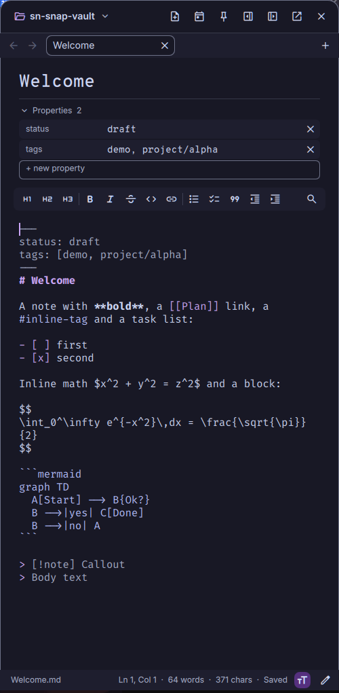
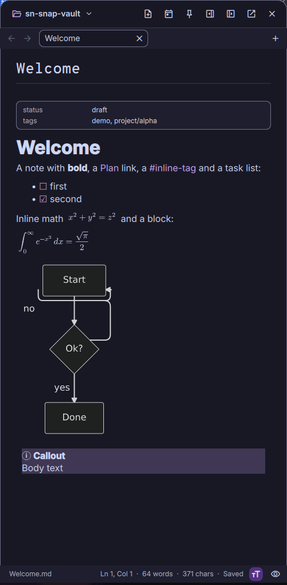

# SuperNote

An Obsidian-style markdown notes vault for [DankMaterialShell](https://github.com/AvengeMedia/DankMaterialShell)
(DMS, Quickshell). It is a DMS plugin: a side panel that opens on a key press, edits plain `.md` files in a folder
you choose, and stays out of the way when closed. Your notes remain ordinary markdown files, so Obsidian, git, or any
editor can open the same folder.

<p align="center">
  
  
</p>

## Features

- **Vault** of plain markdown files (default `~/Documents/notes`, several vaults supported), file tree, autosave with
  conflict detection when a note changes on disk, `.obsidian` daily-note / template / attachment settings honoured
  (read-only).
- **Docked panel** on the right of the screen (sidebar hidden by default) that can be **expanded into a real window**.
- **Markdown editor**: syntax-colored, formatting toolbar and shortcuts, list/task/quote continuation, auto-pairing,
  find / replace, slash menu (`/`), Edit / Split / Preview.
- **Preview**: GitHub-flavoured markdown, callouts, tables, footnotes, note embeds, images, `==highlights==`, LaTeX
  math and Mermaid diagrams (rendered without a browser).
- **Navigation**: tabs with history, quick switcher (`Ctrl+O`), wikilinks with `[[` completion, backlinks, outline,
  command palette (`Ctrl+P`), keyboard cheat sheet (`Ctrl+/`).
- **Organization**: full-text search, nested tags, pinned and recent notes, link-safe rename / move with undo.
- **Capture**: a quick-capture box (`Super+Ctrl+N`) that appends to today's daily note or creates an Inbox note, daily
  notes, templates with variables, paste images from the clipboard, frontmatter properties editor.
- **Scriptable** through `dms ipc call supernote ...` ([docs/IPC.md](docs/IPC.md)).

## Requirements

| | Needed for |
|---|---|
| DankMaterialShell / Quickshell 0.3+ (Qt 6.10) | everything (the plugin runs inside DMS) |
| `bash`, `rg` (ripgrep), `jq`, `gio` (glib) | vault operations, search, trash (required) |
| `wl-clipboard` (`wl-paste`) | paste images, `supernote clip` |
| `typst` (needs network once for the `mitex` package) | LaTeX math in the preview |
| `mmdr` on `PATH`, or network once to fetch a pinned release | Mermaid diagrams |
| `magick` (ImageMagick) | measuring rendered pictures, pasting non-PNG images |
| Node 18+ | running the unit tests only |

Math and Mermaid are optional: without their tools the source stays visible as text / a code block.

## Install

```sh
git clone <this repository> ~/Projects/DMS/plugins/supernote
ln -s ~/Projects/DMS/plugins/supernote ~/.config/DankMaterialShell/plugins/supernote   # or: make link
dms restart
```

Enable **SuperNote** in DMS Settings → Plugins, then bind keys (niri shown; the mango equivalents are in
[docs/CONFIGURATION.md](docs/CONFIGURATION.md#key-bindings)):

```kdl
Mod+Shift+N { spawn "dms" "ipc" "call" "supernote" "toggle"; }
Mod+Ctrl+N  { spawn "dms" "ipc" "call" "supernote" "quick"; }
```

## Quick start

| Key | Action |
|---|---|
| `Super+Shift+N` | open / close the panel |
| `Super+Ctrl+N` | quick capture (`Ctrl+Enter` add to daily note, `Ctrl+Shift+Enter` new Inbox note) |
| `Ctrl+O` / `Ctrl+P` | open a note / command palette |
| `Ctrl+N` / `F2` | new note / rename (edit the title) |
| `Ctrl+E` | cycle Edit → Split → Preview |
| `Ctrl+\` | show / hide the left panel (files, search, tags) |
| `Ctrl+Shift+F` | search all notes |
| `Ctrl+/` | every shortcut |

The full guide is in [docs/USAGE.md](docs/USAGE.md).

## Documentation

- [Usage](docs/USAGE.md) – everything the panel can do
- [IPC](docs/IPC.md) – `dms ipc call supernote ...`
- [Configuration](docs/CONFIGURATION.md) – settings, `.obsidian` compatibility, key bindings, files and paths
- [Architecture](docs/ARCHITECTURE.md) – how the code is organised
- [Development](docs/DEVELOPMENT.md) – dev loop, tests, conventions
- [Rendering](docs/RENDERING.md) – math and Mermaid pipeline
- [Design decisions](docs/DESIGN.md) – why it works the way it does
- [Changelog](CHANGELOG.md)

## License

MIT, see [LICENSE](LICENSE). `js/mdit.js` bundles [markdown-it](https://github.com/markdown-it/markdown-it) (MIT,
`vendor/markdown-it.LICENSE`).
