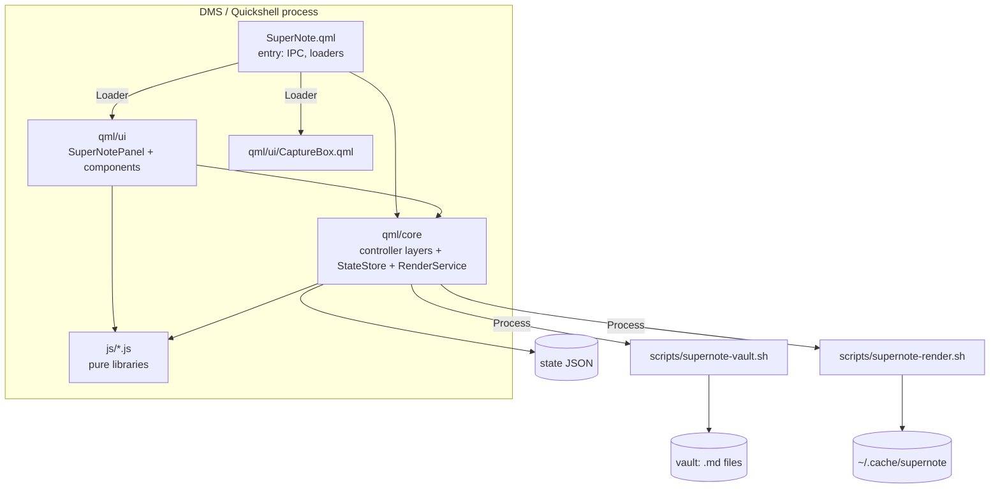

# Architecture

SuperNote is a DMS **daemon plugin** written in QML (Quickshell) plus small bash scripts and pure JavaScript libraries.
The QML holds state and UI; everything that touches the vault goes through `scripts/supernote-vault.sh`; everything
that can be computed without QML types is a JS library that is unit-tested in node.



## Repository layout

```
plugin.json            manifest (id, entry component, settings component)
SuperNote.qml          entry point named by plugin.json: IPC surface, RenderService, UI loaders
SuperNoteSettings.qml  settings page (DMS Settings → Plugins)
qml/core/              the controller (see below)
qml/ui/                the panel: SuperNotePanel.qml (window host), CaptureBox.qml
qml/ui/logic/          panel logic, a chain of QML types (PanelBase ... SyncLayer)
qml/ui/components/     visual components (Header, Sidebar, EditorArea, ...)
qml/ui/widgets/        IconBtn, MenuItem
js/                    pure JavaScript libraries (+ generated mdit.js)
scripts/               supernote-vault.sh, supernote-render.sh, dev/ tools
vendor/                markdown-it (MIT), the source of js/mdit.js
tests/                 node unit tests, shell tests, run-all.sh
docs/                  this documentation
```

## The controller: a chain of layers (`qml/core`)

The controller is **one object built from a chain of QML types**, each adding one concern. QML has no mixins, but a
type can extend another, and inside one object every layer can call every other layer's functions (names resolve on the
shared object at run time). That keeps each file small and focused without a web of cross-references.

```
CoreBase → VaultLayer → NoteLayer → NavLayer → OrganizeLayer → FileOpsLayer → CaptureLayer → WindowLayer → SuperNote
```

| Layer | Owns |
|---|---|
| `CoreBase` (extends DMS `PluginComponent`) | plugin paths, tiny helpers (`toast`, `clone`, ...), running processes (`run`, `vaultRun`), atomic file writes (`writeFile`), the `StateStore` |
| `VaultLayer` | vault list and activation, tree entries / rows, name and attachment indexes, `.obsidian` config (`cfg`), `ensureVault`, the serial job queue, note IO (`readNote`, `putNote`, `putUnique`) |
| `NoteLayer` | the open note: buffer, dirty / conflict, autosave, `saveNow` / `flushSave` / `safely`, external-change check, view mode |
| `NavLayer` | tabs and per-tab history, recents, `doOpen` (the only place a note is loaded), `openLink`, backlinks, right panel |
| `OrganizeLayer` | pinned / recent sections, sidebar tab, full-text search, the vault tag index |
| `FileOpsLayer` | create, folders, trash, link-safe rename / move with confirm and undo, `remapAll` |
| `CaptureLayer` | daily notes, capture, Inbox notes, templates, pasted images |
| `WindowLayer` | panel visibility, docked / window mode, sidebar visibility, one-time state load (`ensureState`) |
| `SuperNote.qml` | IPC handler, the `RenderService` instance, loaders for the panel and the capture box |

Two parts are independent objects rather than layers because nothing else needs their internals:

- `StateStore` – the persisted state file: `read` / `write` (debounced flush) / `afterLoad`. `CoreBase` exposes
  `readState` / `writeState` / `afterState` wrappers. Each layer reads its own keys in a `load<Layer>State()` function;
  `WindowLayer.ensureState()` calls them all once.
- `RenderService` – math / Mermaid pictures ([RENDERING.md](RENDERING.md)).

## The panel (`qml/ui`)

`SuperNote.qml` loads `qml/ui/SuperNotePanel.qml` through a URL with a cache-busting query, passing the controller as
`core`. The panel has two halves:

- **Logic** – `SuperNotePanel` extends a chain in `qml/ui/logic`: `PanelBase` (dialogs, focus, global keys) →
  `EditingLayer` → `FindLayer` → `SidebarLayer` → `SwitcherLayer` (switcher, palette, autocomplete, right-panel data) →
  `PreviewLayer` → `SyncLayer` (keeps the editor in step with the controller). Same idea as the controller chain.
- **Visuals** – components in `qml/ui/components`, each with `required property var ui` (the panel object) and its own
  file: `Header`, `Sidebar` (`FileTree`, `SearchPane`, `TagsPane`), `EditorArea` (`TabBar`, `NoteView` with
  `ConflictBanner`, `PropertiesBlock`, `FormatToolbar`, `FindBar`, `EditorPane`, `PreviewPane`, `StatusBar`),
  `RightPanel`, `Switcher`, `AutocompletePopup`, `CheatSheet`, `VaultMenu`, `ContextMenu`, `ConfirmDialog`.

`SuperNotePanel.qml` itself is the window host: a layer-shell `PanelWindow` (docked) and a `DankFloatingWindow`
(expanded); the single content item `keysScope` is re-parented between them. It also lists, as `readonly property`
aliases, the inner items the logic layers need by name (`editor`, `tree`, `switcherField`, ...). Components never reach
into each other: they talk through `ui` (state and actions) and the controller (`ui.core`).

`CaptureBox.qml` is a separate small layer-shell window loaded on demand, sharing the markdown key handling
(`js/mdkeys.js`) with the editor.

## Pure libraries (`js/`)

`.pragma library` JavaScript with no QML types, so node can load them (`tests/load.js` emulates `.import`).

| File | Purpose |
|---|---|
| `markdown.js` | edit transforms, frontmatter, headings / tags / links, find / replace, wikilink helpers, preview preprocessing (`renderPreview`), the syntax-highlight lexer |
| `mdkeys.js` | key → edit mapping shared by the editor and the capture box |
| `previewhtml.js` (+ generated `mdit.js`) | markdown → Qt rich-text HTML (markdown-it) |
| `tree.js` | tree rows, path helpers (`remapPath`, ...), pinned / recent sections |
| `tabs.js` | tab and history model |
| `links.js` | wikilink resolution and link-safe rewriting |
| `search.js`, `tags.js`, `fuzzy.js` | search result rows and snippets, tag tree, fuzzy ranking |
| `config.js`, `templates.js`, `capture.js`, `slash.js`, `commands.js`, `render.js` | settings merge and date formats, template variables, capture helpers, slash menu, command list / cheat sheet, render cache keys |

## Scripts

- `scripts/supernote-vault.sh` – all vault filesystem work: `init list create mkdir rename trash mtime backlinks search
  readmany read candidates apply undo obsidian-config put paste-image` (header of the file documents each). Every path
  is validated (relative, no `..`, no dot segments, resolved path must stay inside the vault, symlinks included).
- `scripts/supernote-render.sh` – `math`, `mermaid`, `prune`.

## Data flows

**Open a note.** `openNote(rel)` → `navigate` (`safely`: flush the buffer; save the view; apply the tab transition;
persist tabs) → `loadActive` → `doOpen` (cat the file, set the buffer, `loadSerial++`). The panel's `SyncLayer` sees
`loadSerial`, puts the text in the editor, restores cursor and scroll, refreshes outline / links / highlight / preview.

**Edit and save.** The editor calls `core.onEdited(text)` → buffer, `dirty`, autosave timer → `saveNow`: `mtime` check
(mismatch = `conflict`) → `writeFile` → `refreshMtime`. Anything that would replace the buffer runs through
`safely(cb)`, which only continues when the buffer is on disk.

**Rename / move with links.** `moveTo` → `safely` → `planMove` (vault script `candidates` + `readmany`, then
`Links.rewrite` per note) → if links need updating, `movePrompt` (the panel shows the dialog) → `applyMove` writes the
plan file and runs `apply` (checks each note's sha256 against what the plan was built from, backs the originals up,
rewrites, then renames) → `remapAll` updates tabs, recents, pins, expanded folders → `undoRename` restores from the backup.

**Capture.** `capture(text)` → serial job → `ensureVault` → `ensureDaily` (creates the note, atomically, if missing) →
if that note is open, append to the buffer (autosave), otherwise `readNote` → `Capture.appendCapture` → `putNote`.

**Preview.** `refreshPreview` → `Md.renderPreview(buffer, ctx)` → `Html.renderHtml(markdown, colors)` → rich text in the
preview flickable; pictures arrive later through `RenderService`.

## Safety invariants

- A note is never overwritten with text derived from a stale read: the editor checks mtime before saving; the link
  rewriter compares content hashes; capture appends to the *current* buffer when the note is open.
- Nothing replaces an unsaved or conflicted buffer (`safely`); failures abort the operation with a toast.
- Every vault path is validated in the script, and `.obsidian` is only ever read.
- Writes are atomic (`FileView` with `atomicWrites`, or temp file + `mv` / `ln` in the scripts).
- Destructive operations back up first (link updates) or go to the trash (`gio trash`).

## QML gotchas that shaped the code

- **Caching**: `dms ipc call plugins reload supernote` re-reads only the entry file (`SuperNote.qml`); every other QML /
  JS file is cached by URL. The panel and capture box are loaded through cache-busting URLs, but their children are not.
  After editing anything else, run `dms restart`.
- **`FileView.setText("")` never reports `saved`**, so empty writes are done with a shell command (`writeFile`).
- **No file watchers**: this environment runs out of inotify watches, so external changes are detected on reopen.
- **Ids are file-scoped**, which is why cross-file items are exposed as properties (`readonly property var editor:`).
- A `Connections` element targeting a nested `QtObject` crashed Quickshell; the panel watches
  `core.render.serial` through a property change handler instead.
