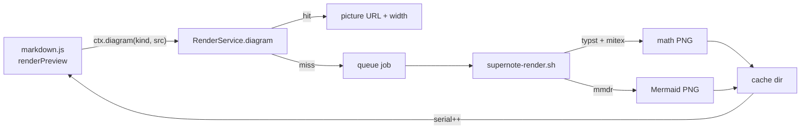

# Math and Mermaid rendering

The Preview draws LaTeX math and Mermaid diagrams as pictures. Nothing else in SuperNote depends on this: when a tool
is missing, the network is down or the source is invalid, the raw text or code block stays visible.

## Pipeline



1. `markdown.js` (`renderPreview`) finds `$..$`, `$$..$$` and ```` ```mermaid ```` blocks. For each it calls
   `ctx.diagram(kind, source, display)`. When that returns `{url, w}` the source is replaced by
   ``; otherwise the source stays as it is.
2. `RenderService.diagram` (`qml/core/RenderService.qml`) computes a cache key from the kind, the source, `display`
   and the theme (text color, dark / light) and looks it up. A miss queues a background job and returns `null`.
3. `scripts/supernote-render.sh` renders one picture: `math` (typst) or `mermaid` (mmdr) into
   `~/.cache/supernote/render/<key>.png` at 2x and prints `<width> <height>`.
4. When a job finishes `RenderService.serial` bumps and the preview re-renders; the picture is now found.

## Details

- **Detection**: inline math needs a non-space right after the opening `$` and before the closing `$`, and the closing
  `$` must not be followed by a digit; spans that look like prices (`$5 and 5$`), `\$` escapes, code spans and code
  fences are left alone. `$$..$$` may span lines. A `mermaid` fence needs a matching closing fence of the same kind.
- **Math** is written in LaTeX and converted by Typst's `mitex` package (pinned to 0.2.7; the first render downloads
  it). Typst reads the source through `--input` and writes the PNG to stdout, because the snap-packaged `typst`
  cannot write into hidden folders such as `~/.cache`.
- **Mermaid** uses [`mmdr`](https://github.com/1jehuang/mermaid-rs-renderer) (pure Rust, no browser). Lookup order:
  `$SN_MMDR`, `mmdr` on `PATH`, the cached pinned release (v0.3.1, SHA-256 verified, downloaded once). The diagram is
  first measured (`mmdr --size`, which also rejects invalid syntax), then rendered at twice that size with the built-in
  `dark` or `default` theme and a transparent background. `mmdr` supports 23 diagram types; it is young, so styling
  can differ from mermaid.js and some diagrams may fail. Those stay code blocks and produce one toast per session.
- **Scale**: pictures are 2x; the preview shows them at half their pixel width (capped to the pane width).
- **Limits**: sources over 20 kB are not rendered; pictures wider than 6000 px or taller than 5000 px are refused;
  a pass over a note requests at most 40 new pictures (the rest follows on the next pass); jobs from a previous pass
  that are no longer on screen are dropped; two math jobs and one Mermaid job run at a time; each job has a timeout.
- **Retries**: a failed picture is retried after 60 seconds (so installing a tool or coming back online fixes it
  without a restart).
- **Cache**: keyed by content and theme, so a theme change re-renders. Files older than 45 days are pruned at start-up
  and at most 800 are kept.

## Running the script by hand

```sh
scripts/supernote-render.sh math    src.tex     out.png '#e6e6e6' 1   # display math, light text
scripts/supernote-render.sh mermaid diagram.mmd out.png '#e6e6e6' 1   # dark theme
scripts/supernote-render.sh prune
```

`tests/render.test.sh` covers the script (tools that are unavailable are skipped).
